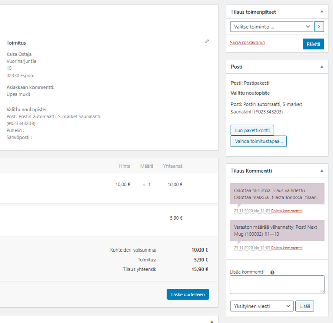
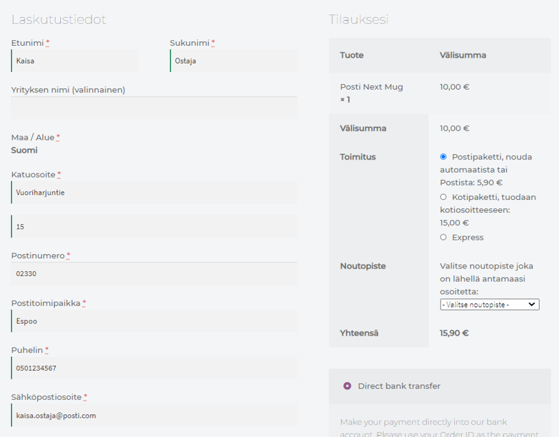

# Posti Shipping plugin for WooCommerce

# Maturity

> This software is now available for General Availability.

# Installation

This plugin can be installed via [WordPress.org plugin directory](https://wordpress.org/plugins/posti-shipping-plugin/), WP-CLI or Composer:

```sh
wp plugin install --activate posti-shipping-plugin
# OR
wp plugin install --activate https://github.com/PostiDigital/woocommerce-shipping-plugin/archive/master.zip
# OR
composer require posti/woocommerce-shipping-plugin
```

The plugin requires WooCommerce >=4.4 to be installed, with shipping zones configured and this plugin activated and settings set.

Naturally the store owner also needs to have a contract with Posti.

# Features

* Integrates [Posti](https://www.posti.fi/) with WooCommerce
* Supports WooCommerce shipping zones
* Store owners can use any shipping method plugin to offer shipping at checkout
* Customers can choose to ship products to an address or to any pickup point available from the Posti shipping methods
* Store owner can generate the shipping label in one click
* Store owners and customers get tracking code links and status information
* Based on the official [Pakettikauppa Plugin](https://github.com/seravo/woo-pakettikauppa)

# Screenshots




# Changelog

See git history.

# For developers

Pull requests are welcome!

Before submitting your patch, please make sure it is of high quality:

* Follow the [WordPress Codex plugin writing recommendations](https://codex.wordpress.org/Writing_a_Plugin) and also check the [WordPress Plugin Handbook](https://developer.wordpress.org/plugins/)
* Follow the specific [WooCommmerce plugin recommendations](https://docs.woocommerce.com/document/create-a-plugin/)
* Test the code on a clean WordPress/WooCommmerce installation with standard [dummy data](https://docs.woocommerce.com/document/importing-woocommerce-dummy-data/)
* Make sure the test suite passes locally and on Travis-CI
* Check that the code style is valid when tested with the phpcs.xml included in this project

## Developer docs

Please note that the official docs at https://docs.woocommerce.com/document/shipping-method-api/ contain partially outdated information. For more information, see wiki at https://github.com/woocommerce/woocommerce/wiki/Shipping-Method-API or dive directly into the source using [GitHub search](https://github.com/woocommerce/woocommerce/search?utf8=%E2%9C%93&q=extends+WC_Shipping_Method&type=) to find up-to-date examples on how to extend the shipping method class.

## Travis CI and automatic testing

This project has a `.travis-ci.yml` definition which can be used by anybody. Just follow these steps:
1. Create an account at [Travis-CI.org](https://travis-ci.org/) by logging in with your Github.com account.
2. Make sure you have a fork of this repository in your own Github.com account.
3. Open the [Travis-CI.org settings page](https://travis-ci.org/account/repositories) and click "Sync repositories"
4. Search for `woocommerce-shipping-plugin` in your repository list and enable automatic testing for the repository it.
5. Initially the page `https://travis-ci.org/<username>/woocommerce-shipping-plugin` will be empty, but as soon as you push your first commit Travis-CI will run the first built. You can also manually trigger a build to get it started.

## Branching and releases

### Development always targets master branch

All bugfixes and new features are developed on separate git branches. Work-in-progress can be marked by appending "WIP:" to the commit message or the pull request title. Once a feature is ready, a pull request is opened for comments and review. Pull requests should not include any updates to the changelog or version number, as those are done separately at release time to match the actual release. Making a pull request implies that comments and review are requested, so wait at least 24h after making a new PR so others have time to respond.

Very small bugfixes that don't need any reviews (e.g. fixing spelling errors) can be applied directly on master. Note that all commits must pass CI, so Travis-CI needs to see a commit on some branch first and Github needs to register that commit as passing CI. Then those commits can be merged directly on master by a developer who has write access to master, without making a separate pull request on Github.

As this is a WordPress plugin, there can only be one version released. Thus there are no separate maintenance release branches (once 2.1.x has been released, the next release must be 2.1.y or higher, there cannot be any maintenance releases for 2.0.x).

`Text` is bit of a special case, it's only real purpose is to serve as a key-value store for strings that require translation. Currently the plugin has `__` and `_e` calls scattered all over it – in the future, all of them should live in `Text`. The advantage of doing so is being able to replace any text in the whitelabel forks.

### Templates

The plugin have some template files, which is displaying via `wc_get_template` function, so they can be overrided in the theme. To do that, need copy files from Pakettikauppa plugin directory (`/wp-content/plugins/woo-pakettikauppa/templates/pakettikauppa`) to Wordpress theme directory (`/wp-content/themes/<theme_name>/woocommerce/pakettikauppa`).
